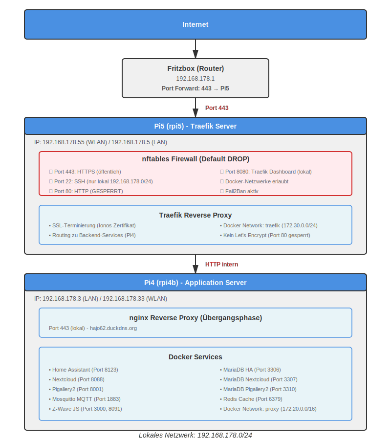
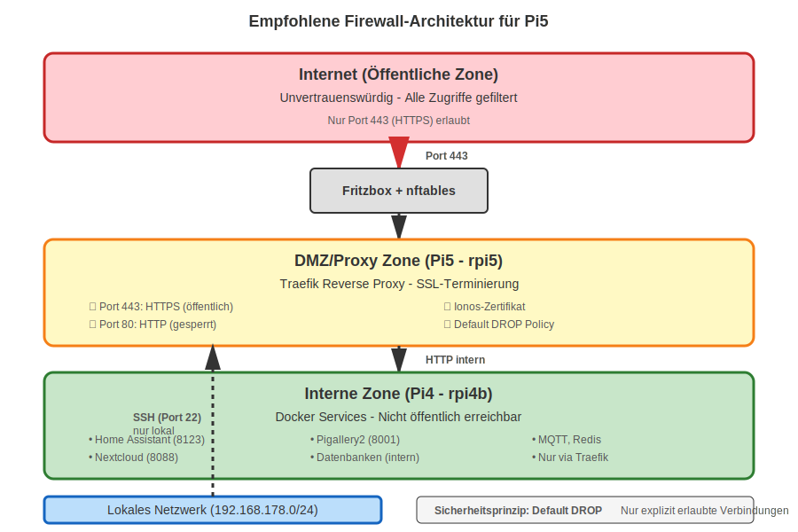

# Linux Firewall Setup für Raspberry Pi 5 (rpi5) mit Docker

**System:** RaspberryOS Trixie (Debian 12)
**Hostname:** rpi5
**IP-Adressen:** 192.168.178.55 (WLAN) / 192.168.178.5 (LAN) - **Aktuell: WLAN**
**Firewall:** nftables
**Strategie:** Default DROP (alles blockiert, Ausnahmen erlauben)
**Geplante Services:** Traefik Reverse Proxy
**Zertifikate:** Ionos (kein Let's Encrypt)
**Erstellt:** 2026-02-17

---

## 🏗️ Architektur-Übersicht

### Netzwerk-Topologie



**Komponenten:**
- **Internet** → Fritzbox (Port 443 Forward) → **Pi5 (Traefik)** → **Pi4 (Services)**
- **Lokales Netzwerk:** 192.168.178.0/24
- **Pi5 (rpi5):** 192.168.178.55 (WLAN) / 192.168.178.5 (LAN) - Traefik Reverse Proxy mit Ionos SSL
- **Pi4 (rpi4b):** 192.168.178.3 (LAN) / 192.168.178.33 (WLAN) - Docker Services (Home Assistant, Nextcloud, etc.)
- **Aktuell:** Pi5 über WLAN (192.168.178.55), Pi4 über LAN (192.168.178.3)

### Sicherheitszonen



**Zonen-Konzept:**
- 🔴 **Öffentliche Zone (Internet):** Unvertrauenswürdig, nur Port 443 erlaubt
- 🟡 **DMZ/Proxy Zone (Pi5):** Traefik mit SSL-Terminierung, Default DROP
- 🟢 **Interne Zone (Pi4):** Services nicht öffentlich erreichbar, nur via Traefik
- 🔵 **Lokales Netzwerk:** SSH-Zugriff, Management, direkter Service-Zugriff

---

## 📋 Inhaltsverzeichnis

1. [Firewall-Grundlagen](#1-firewall-grundlagen)
2. [Port-Übersicht](#2-port-übersicht)
3. [Phase 1: Basis-Absicherung](#phase-1-basis-absicherung-jetzt)
4. [Phase 2: Docker-Vorbereitung](#phase-2-docker-vorbereitung)
5. [Phase 3: Traefik-Produktion](#phase-3-traefik-produktion)
6. [SSH-Absicherung](#4-ssh-absicherung)
7. [Fail2Ban Installation](#5-fail2ban-installation)
8. [Docker-Konfiguration](#6-docker-konfiguration)
9. [Nützliche Befehle](#7-nützliche-befehle)
10. [Troubleshooting](#8-troubleshooting)

---

## 1. Firewall-Grundlagen

### Was ist nftables?

RaspberryOS Trixie verwendet **nftables** als modernes Firewall-Framework (Nachfolger von iptables). Es kontrolliert den Netzwerkverkehr durch Regeln.

### Grundprinzipien

**Drei Hauptketten (Chains):**
- **INPUT**: Eingehender Traffic zum System
- **OUTPUT**: Ausgehender Traffic vom System  
- **FORWARD**: Traffic, der durch das System weitergeleitet wird (wichtig für Docker!)

**Sicherheitsstrategie:**
- ✅ **Default DROP** (alles blockiert, Ausnahmen erlauben) - EMPFOHLEN
- ❌ **Default ACCEPT** (alles erlaubt, Ausnahmen blockieren) - UNSICHER

### Connection States

- **NEW**: Neue Verbindung
- **ESTABLISHED**: Bestehende Verbindung
- **RELATED**: Zugehörige Verbindung (z.B. FTP-Datenkanal)
- **INVALID**: Ungültige Pakete

---

## 2. Port-Übersicht

### Pi5 (rpi5) - Traefik Server

#### Öffentlich erreichbar (Internet → Fritzbox → Pi5)

| Port | Protokoll | Service | Status | Beschreibung |
|------|-----------|---------|--------|--------------|
| 80 | TCP | HTTP | ❌ GESPERRT | Nicht benötigt (Ionos Zertifikat) |
| 443 | TCP | HTTPS | ✅ OFFEN | Traefik Reverse Proxy mit Ionos SSL |

#### Lokal erreichbar (nur 192.168.178.0/24)

| Port | Protokoll | Service | Status | Beschreibung |
|------|-----------|---------|--------|--------------|
| 22 | TCP | SSH | ✅ OFFEN | Systemverwaltung (Rate Limited) |
| 8080 | TCP | Traefik Dashboard | ✅ OFFEN | Web-Interface (optional) |
| 8090 | TCP | signal-cli-rest-api | ✅ OFFEN | Signal Messenger API |

#### Docker-intern (nur zwischen Containern auf Pi5)

| Port | Protokoll | Service | Beschreibung |
|------|-----------|---------|--------------|
| - | - | - | Keine internen Services geplant |

---

### Pi4 (rpi4b) - Application Server

**Hinweis:** Diese Ports sind auf Pi4, nicht auf Pi5! Pi5 greift über HTTP auf Pi4 zu.

#### Lokal erreichbar (nur 192.168.178.0/24)

| Port | Protokoll | Service | Beschreibung |
|------|-----------|---------|--------------|
| 443 | TCP | nginx | Aktueller Reverse Proxy (Übergangsphase) |
| 8123 | TCP | Home Assistant | Smart Home Interface |
| 8088 | TCP | Nextcloud | Cloud Storage |
| 8001 | TCP | Pigallery2 | Foto-Galerie |
| 8090 | TCP | signal-cli-rest-api | Signal Messenger API für Home Assistant |

#### Docker-intern (nur zwischen Containern auf Pi4)

| Port | Protokoll | Service | Beschreibung |
|------|-----------|---------|--------------|
| 3306 | TCP | MariaDB | Datenbank (Home Assistant) |
| 3307 | TCP | MariaDB | Datenbank (Nextcloud) |
| 3310 | TCP | MariaDB | Datenbank (Pigallery2) |
| 6379 | TCP | Redis | Cache (Nextcloud) |
| 1883 | TCP | Mosquitto | MQTT Broker |
| 8080 | TCP | signal-cli-rest-api | Signal API (intern, alter Container) |

**Hinweis zu signal-cli-rest-api:**
- Der neue standalone Container (`docker/signal-cli-rest-api/`) verwendet Port **8090** (lokal erreichbar)
- Der alte Container im docker-compose-Pi4-NEW.yaml verwendet Port **8080** (nur homeassistant_internal)
- Port 8090 ist im `proxy`-Netzwerk und benötigt Internet-Zugriff (DNS: Cloudflare/Google)

---

## 3. Schritt-für-Schritt Installation

### Phase 1: Basis-Absicherung (JETZT - Pi5)

**Ziel:** Pi5 (rpi5) grundlegend absichern, SSH-Zugriff sicherstellen

#### 1.1 Hostname setzen

```bash
# Hostname auf rpi5 setzen
sudo hostnamectl set-hostname rpi5

# Prüfen
hostnamectl
```

#### 1.2 Aktuelle Firewall prüfen

```bash
# Status anzeigen
sudo nft list ruleset

# Sollte leer oder minimal sein bei frischem System
```

#### 1.3 Basis-Konfiguration erstellen

```bash
# Backup erstellen (falls vorhanden)
sudo cp /etc/nftables.conf /etc/nftables.conf.backup

# Neue Konfiguration erstellen
sudo nano /etc/nftables.conf
```

**Inhalt für `/etc/nftables.conf` (Pi5):**

```nft
#!/usr/sbin/nft -f
# Basis-Firewall für Pi5 (rpi5) - RaspberryOS Trixie
# Phase 1: Grundlegende Absicherung
# Strategie: Default DROP

flush ruleset

table inet filter {
    # Lokales Netzwerk definieren
    set local_network {
        type ipv4_addr
        flags interval
        elements = { 192.168.178.0/24 }
    }

    chain input {
        type filter hook input priority filter; policy drop;
        
        # Loopback-Interface erlauben (wichtig für lokale Prozesse!)
        iif lo accept
        
        # Bestehende Verbindungen erlauben
        ct state established,related accept
        
        # Ungültige Pakete ablehnen
        ct state invalid drop
        
        # SSH von lokalem Netzwerk mit Rate Limiting
        ip saddr @local_network tcp dport 22 ct state new limit rate 3/minute accept
        
        # ICMP (Ping) erlauben
        ip protocol icmp accept
        ip6 nexthdr icmpv6 accept
        
        # Port 80 explizit blockieren (auch wenn Fritzbox nicht weiterleitet)
        tcp dport 80 drop
        
        # Logging für abgelehnte Pakete (optional, auskommentiert)
        # log prefix "FW-DROP: " drop
        
        # Alles andere ablehnen
        drop
    }

    chain forward {
        type filter hook forward priority filter; policy drop;
        
        # Wird später für Docker benötigt
        drop
    }

    chain output {
        type filter hook output priority filter; policy accept;
        
        # Ausgehender Traffic erlaubt
    }
}
```

#### 1.3 Firewall aktivieren

⚠️ **WICHTIG:** Teste die Konfiguration, bevor du die Verbindung trennst!

```bash
# Syntax prüfen
sudo nft -c -f /etc/nftables.conf

# Temporär laden (zum Testen)
sudo nft -f /etc/nftables.conf

# In NEUEM Terminal: SSH-Verbindung testen
ssh user@192.168.178.3

# Wenn SSH funktioniert: Permanent aktivieren
sudo systemctl enable nftables
sudo systemctl start nftables

# Status prüfen
sudo systemctl status nftables
```

#### 1.4 Notfall-Rückgängig

Falls du ausgesperrt wirst (nur mit physischem Zugang):

```bash
# Firewall komplett deaktivieren
sudo systemctl stop nftables
sudo systemctl disable nftables

# Oder alle Regeln löschen
sudo nft flush ruleset
```

---

### Phase 2: Docker-Vorbereitung (Pi5)

**Ziel:** Firewall für Docker-Netzwerke vorbereiten (VOR Docker-Installation!)

#### 2.1 Erweiterte Konfiguration

```bash
sudo nano /etc/nftables.conf
```

**Aktualisierter Inhalt für Pi5:**

```nft
#!/usr/sbin/nft -f
# Phase 2: Docker-Vorbereitung für Pi5 (rpi5)
# Strategie: Default DROP

flush ruleset

table inet filter {
    # Lokales Netzwerk
    set local_network {
        type ipv4_addr
        flags interval
        elements = { 192.168.178.0/24 }
    }
    
    # Pi4 Backend-Server
    set backend_servers {
        type ipv4_addr
        elements = { 192.168.178.3 }
    }

    chain input {
        type filter hook input priority filter; policy drop;
        
        # Loopback
        iif lo accept
        
        # Bestehende Verbindungen
        ct state established,related accept
        
        # Ungültige Pakete ablehnen
        ct state invalid drop
        
        # SSH mit Rate Limiting (Brute-Force-Schutz)
        ip saddr @local_network tcp dport 22 ct state new limit rate 3/minute accept
        
        # Docker-Netzwerke erlauben
        iifname "docker0" accept
        iifname "br-*" accept
        
        # Port 80 explizit blockieren
        tcp dport 80 drop
        
        # ICMP
        ip protocol icmp accept
        ip6 nexthdr icmpv6 accept
    }

    chain forward {
        type filter hook forward priority filter; policy drop;
        
        # Docker-Container-Kommunikation
        ct state established,related accept
        
        # Docker Bridge-Netzwerke
        iifname "docker0" accept
        oifname "docker0" accept
        iifname "br-*" accept
        oifname "br-*" accept
    }

    chain output {
        type filter hook output priority filter; policy accept;
    }
}
```

#### 2.2 Neu laden

```bash
# Syntax prüfen
sudo nft -c -f /etc/nftables.conf

# Neu laden
sudo systemctl restart nftables

# Regeln anzeigen
sudo nft list ruleset
```

---

### Phase 3: Traefik-Produktion (Pi5)

**Ziel:** HTTPS-Port öffnen, Traefik mit Ionos-Zertifikat produktiv schalten

#### 3.1 Finale Konfiguration für Pi5

```bash
sudo nano /etc/nftables.conf
```

**Finale Produktiv-Konfiguration für Pi5 (rpi5):**

```nft
#!/usr/sbin/nft -f
# Phase 3: Produktiv-Konfiguration für Pi5 (rpi5) mit Traefik
# Strategie: Default DROP
# Zertifikate: Ionos (kein Let's Encrypt)

flush ruleset

# NAT-Tabelle für Docker (WICHTIG!)
table ip nat {
    chain PREROUTING {
        type nat hook prerouting priority dstnat; policy accept;
    }
    
    chain INPUT {
        type nat hook input priority 100; policy accept;
    }
    
    chain OUTPUT {
        type nat hook output priority -100; policy accept;
    }
    
    chain POSTROUTING {
        type nat hook postrouting priority srcnat; policy accept;
        # Docker-Netzwerke maskieren
        ip saddr 172.20.0.0/16 oifname != "br-*" masquerade
        ip saddr 172.30.0.0/16 oifname != "br-*" masquerade
    }
    
    chain DOCKER {
        type nat hook prerouting priority dstnat; policy accept;
    }
}

table inet filter {
    # Lokales Netzwerk
    set local_network {
        type ipv4_addr
        flags interval
        elements = { 192.168.178.0/24 }
    }
    
    # Pi4 Backend-Server (für Traefik-Zugriff)
    # Pi4: 192.168.178.3 (LAN) / 192.168.178.33 (WLAN) - Aktuell: LAN
    set backend_servers {
        type ipv4_addr
        elements = { 192.168.178.3, 192.168.178.33 }
    }
    
    # Öffentliche Ports (nur HTTPS!)
    set public_ports {
        type inet_service
        elements = { 443 }
    }
    
    # Lokale Management-Ports
    set local_management_ports {
        type inet_service
        elements = { 8080, 8090 }  # Traefik Dashboard, signal-cli-rest-api
    }

    chain input {
        type filter hook input priority filter; policy drop;
        
        # Loopback
        iif lo accept
        
        # Bestehende Verbindungen
        ct state established,related accept
        
        # Ungültige Pakete ablehnen
        ct state invalid drop
        
        # SSH mit Rate Limiting (nur lokales Netzwerk)
        ip saddr @local_network tcp dport 22 ct state new limit rate 3/minute accept
        
        # HTTPS öffentlich (Traefik mit Ionos-Zertifikat)
        tcp dport @public_ports accept
        
        # Port 80 explizit blockieren (kein Let's Encrypt benötigt)
        tcp dport 80 drop
        
        # Management-Ports nur von lokalem Netzwerk
        ip saddr @local_network tcp dport @local_management_ports accept
        
        # Docker-Netzwerke
        iifname "docker0" accept
        iifname "br-*" accept
        
        # ICMP
        ip protocol icmp accept
        ip6 nexthdr icmpv6 accept
        
        # Optional: Logging für abgelehnte Pakete
        # log prefix "Pi5-FW-DROP: " drop
    }

    chain forward {
        type filter hook forward priority filter; policy drop;
        
        # Docker-Container-Kommunikation
        ct state established,related accept
        
        # Docker Bridge-Netzwerke
        iifname "docker0" accept
        oifname "docker0" accept
        iifname "br-*" accept
        oifname "br-*" accept
        
        # Traefik zu Backend-Servern (Pi4)
        ip daddr @backend_servers accept
    }

    chain output {
        type filter hook output priority filter; policy accept;
    }
}
```

#### 3.2 Wichtige Hinweise zur Konfiguration

**Port 80 ist gesperrt:**
- ❌ Kein HTTP-Traffic erlaubt
- ✅ Ionos-Zertifikat wird manuell eingebunden
- ✅ Kein Let's Encrypt Challenge benötigt

**HTTPS (Port 443):**
- ✅ Öffentlich erreichbar
- ✅ Traefik terminiert SSL mit Ionos-Zertifikat
- ✅ Leitet Traffic zu Pi4-Services weiter

**Traefik Dashboard (Port 8080):**
- ✅ Nur von lokalem Netzwerk erreichbar
- ⚠️ Optional: Kann auch deaktiviert werden

#### 3.3 Ionos-Zertifikat einbinden

**Zertifikat-Dateien von Ionos:**
- `certificate.crt` - Dein Zertifikat
- `private.key` - Private Key
- `ca-bundle.crt` - Intermediate Zertifikate

**Empfohlene Verzeichnisstruktur:**
```bash
# Verzeichnis erstellen
sudo mkdir -p /opt/traefik/certs

# Zertifikate kopieren (von deinem lokalen Rechner)
scp certificate.crt user@192.168.178.55:/tmp/
scp private.key user@192.168.178.55:/tmp/
scp ca-bundle.crt user@192.168.178.55:/tmp/

# Auf Pi5: Verschieben und Rechte setzen
sudo mv /tmp/certificate.crt /opt/traefik/certs/
sudo mv /tmp/private.key /opt/traefik/certs/
sudo mv /tmp/ca-bundle.crt /opt/traefik/certs/

# Rechte setzen
sudo chmod 600 /opt/traefik/certs/private.key
sudo chmod 644 /opt/traefik/certs/certificate.crt
sudo chmod 644 /opt/traefik/certs/ca-bundle.crt
```

#### 3.4 Firewall aktivieren

```bash
# Syntax prüfen
sudo nft -c -f /etc/nftables.conf

# Neu laden
sudo systemctl restart nftables

# Regeln anzeigen
sudo nft list ruleset

# Prüfen, dass Port 80 blockiert ist
sudo nft list ruleset | grep "tcp dport 80"
```

---

## 4. SSH-Absicherung

### 4.1 SSH-Konfiguration härten

```bash
sudo nano /etc/ssh/sshd_config
```

**Empfohlene Einstellungen:**

```conf
# Port (Standard belassen oder ändern)
Port 22

# Root-Login verbieten
PermitRootLogin no

# Nur Public-Key-Authentifizierung (nach Key-Setup!)
PubkeyAuthentication yes
PasswordAuthentication no

# Keine leeren Passwörter
PermitEmptyPasswords no

# X11 Forwarding deaktivieren (falls nicht benötigt)
X11Forwarding no

# Nur bestimmte Benutzer erlauben (optional)
AllowUsers hajo

# Login-Timeout
LoginGraceTime 60

# Max. Authentifizierungsversuche
MaxAuthTries 3
```

### 4.2 SSH-Keys einrichten (VORHER!)

⚠️ **Wichtig:** Richte SSH-Keys ein, BEVOR du `PasswordAuthentication no` setzt!

**Auf deinem lokalen Computer:**

```bash
# SSH-Key generieren (falls noch nicht vorhanden)
ssh-keygen -t ed25519 -C "deine@email.de"

# Public Key zum Pi5 kopieren
ssh-copy-id hajo@192.168.178.55

# Testen
ssh hajo@192.168.178.55
```

### 4.3 SSH-Dienst neu starten

```bash
# Konfiguration testen
sudo sshd -t

# Neu starten
sudo systemctl restart sshd
```

---

## 5. Fail2Ban Installation

Fail2Ban schützt vor Brute-Force-Angriffen durch temporäres Sperren von IP-Adressen.

### 5.1 Installation

```bash
sudo apt update
sudo apt install fail2ban
```

### 5.2 Konfiguration

```bash
# Lokale Konfiguration erstellen
sudo nano /etc/fail2ban/jail.local
```

**Inhalt:**

```ini
[DEFAULT]
# Ban-Zeit: 1 Stunde
bantime = 3600

# Zeitfenster für Fehlversuche: 10 Minuten
findtime = 600

# Max. Fehlversuche
maxretry = 3

# Backend für nftables
banaction = nftables-multiport
banaction_allports = nftables-allports

[sshd]
enabled = true
port = 22
filter = sshd
logpath = /var/log/auth.log
maxretry = 3
```

### 5.3 Aktivieren

```bash
# Starten und aktivieren
sudo systemctl enable fail2ban
sudo systemctl start fail2ban

# Status prüfen
sudo fail2ban-client status
sudo fail2ban-client status sshd

# Gebannte IPs anzeigen
sudo fail2ban-client get sshd banned
```

---

## 6. Docker-Konfiguration (Pi5)

### 6.1 Docker-Daemon konfigurieren

```bash
sudo nano /etc/docker/daemon.json
```

**Inhalt für Pi5:**

```json
{
  "iptables": true,
  "ip-forward": true,
  "userland-proxy": false,
  "log-driver": "json-file",
  "log-opts": {
    "max-size": "10m",
    "max-file": "3"
  },
  "default-address-pools": [
    {
      "base": "172.30.0.0/16",
      "size": 24
    }
  ]
}
```

**Hinweis:** Subnet 172.30.0.0/16 für Pi5, um Konflikte mit Pi4 (172.20.0.0/16) zu vermeiden.

### 6.2 Docker neu starten

```bash
sudo systemctl restart docker

# Status prüfen
sudo systemctl status docker
```

### 6.3 Docker-Netzwerke erstellen

```bash
# Proxy-Netzwerk für Traefik (auf Pi5)
docker network create \
  --driver bridge \
  --subnet 172.30.0.0/24 \
  --gateway 172.30.0.1 \
  traefik

# Netzwerke anzeigen
docker network ls
docker network inspect traefik
```

### 6.4 Traefik Docker-Compose Beispiel

**Verzeichnisstruktur:**
```
/opt/traefik/
├── docker-compose.yml
├── traefik.yml
└── certs/
    ├── certificate.crt
    ├── private.key
    └── ca-bundle.crt
```

**docker-compose.yml:**
```yaml
version: '3.9'

services:
  traefik:
    image: traefik:v3.0
    container_name: traefik
    restart: unless-stopped
    networks:
      - traefik
    ports:
      - "443:443"
      - "8080:8080"  # Dashboard (optional)
    volumes:
      - /var/run/docker.sock:/var/run/docker.sock:ro
      - ./traefik.yml:/etc/traefik/traefik.yml:ro
      - ./certs:/certs:ro
    environment:
      - TZ=Europe/Berlin

networks:
  traefik:
    external: true
```

**traefik.yml (Basis-Konfiguration):**
```yaml
# Traefik Konfiguration für Pi5 mit Ionos-Zertifikat

api:
  dashboard: true
  insecure: true  # Dashboard auf Port 8080 (nur lokal erreichbar)

entryPoints:
  websecure:
    address: ":443"
    http:
      tls:
        certResolver: ionos

providers:
  docker:
    endpoint: "unix:///var/run/docker.sock"
    exposedByDefault: false
    network: traefik
  file:
    filename: /etc/traefik/dynamic.yml

# Ionos-Zertifikat (statisch)
tls:
  certificates:
    - certFile: /certs/certificate.crt
      keyFile: /certs/private.key

log:
  level: INFO

accessLog: {}
```

### 6.5 Backend-Services auf Pi4 vorbereiten

**Wichtig:** Services auf Pi4 müssen für Traefik erreichbar sein.

**Beispiel für Home Assistant auf Pi4:**
- Traefik auf Pi5 greift auf `http://192.168.178.3:8123` zu
- Keine Änderung an Pi4-Firewall nötig (lokales Netzwerk)
- Pi4 nginx kann parallel weiterlaufen (Übergangsphase)

---

## 7. Nützliche Befehle

### Firewall-Verwaltung

```bash
# Alle Regeln anzeigen
sudo nft list ruleset

# Nur Input-Chain anzeigen
sudo nft list chain inet filter input

# Firewall neu laden
sudo systemctl restart nftables

# Firewall-Status
sudo systemctl status nftables

# Firewall temporär deaktivieren (Notfall!)
sudo nft flush ruleset

# Logs ansehen
sudo journalctl -u nftables -f
```

### Port-Überwachung

```bash
# Offene Ports anzeigen
sudo ss -tulpn

# Nur TCP
sudo ss -tlpn

# Nur UDP
sudo ss -ulpn

# Verbindungen anzeigen
sudo ss -tupn

# Mit netstat (falls installiert)
sudo netstat -tulpn
```

### Docker-Netzwerk

```bash
# Netzwerke anzeigen
docker network ls

# Netzwerk inspizieren
docker network inspect proxy

# Container in Netzwerk anzeigen
docker network inspect proxy | grep -A 10 Containers

# Docker-Firewall-Regeln anzeigen
sudo iptables -L -n -v
sudo iptables -t nat -L -n -v
```

### Fail2Ban

```bash
# Status aller Jails
sudo fail2ban-client status

# Status eines spezifischen Jails
sudo fail2ban-client status sshd

# Gebannte IPs anzeigen
sudo fail2ban-client get sshd banned

# IP manuell bannen
sudo fail2ban-client set sshd banip 192.168.1.100

# IP entbannen
sudo fail2ban-client set sshd unbanip 192.168.1.100

# Logs ansehen
sudo tail -f /var/log/fail2ban.log
```

---

## 8. Troubleshooting

### Problem: Ausgesperrt nach Firewall-Aktivierung

**Lösung (mit physischem Zugang):**

```bash
# Firewall komplett stoppen
sudo systemctl stop nftables

# Oder alle Regeln löschen
sudo nft flush ruleset

# Konfiguration prüfen
sudo nft -c -f /etc/nftables.conf
```

### Problem: Docker-Container können nicht kommunizieren

**Diagnose:**

```bash
# Docker-Netzwerke prüfen
docker network ls
docker network inspect proxy

# Container-Logs prüfen
docker logs container_name

# Firewall-Regeln für Docker prüfen
sudo nft list chain inet filter forward
```

**Lösung:**

```bash
# Stelle sicher, dass Forward-Chain Docker erlaubt
sudo nft add rule inet filter forward iifname "docker0" accept
sudo nft add rule inet filter forward oifname "docker0" accept
```

### Problem: Service von außen nicht erreichbar

**Diagnose:**

```bash
# Port-Forwarding im Router prüfen
# Firewall-Regeln prüfen
sudo nft list ruleset | grep "80\|443"

# Service läuft?
sudo ss -tlpn | grep ":80\|:443"

# Docker-Container läuft?
docker ps
```

**Lösung:**

```bash
# Port in Firewall öffnen
sudo nft add rule inet filter input tcp dport 80 accept
sudo nft add rule inet filter input tcp dport 443 accept

# Permanent: /etc/nftables.conf bearbeiten und neu laden
sudo systemctl restart nftables
```

### Problem: Fail2Ban funktioniert nicht

**Diagnose:**

```bash
# Fail2Ban-Status
sudo systemctl status fail2ban

# Logs prüfen
sudo tail -f /var/log/fail2ban.log

# Jail-Status
sudo fail2ban-client status sshd
```

**Lösung:**

```bash
# Fail2Ban neu starten
sudo systemctl restart fail2ban

# Konfiguration testen
sudo fail2ban-client -d

# Backend prüfen (sollte nftables sein)
sudo fail2ban-client get sshd actions
```

### Problem: Docker-Container haben kein Internet

**Diagnose:**

```bash
# IP-Forwarding aktiviert?
cat /proc/sys/net/ipv4/ip_forward
# Sollte "1" sein

# NAT-Regeln vorhanden?
sudo iptables -t nat -L -n -v
```

**Lösung:**

```bash
# IP-Forwarding aktivieren
sudo sysctl -w net.ipv4.ip_forward=1

# Permanent machen
echo "net.ipv4.ip_forward=1" | sudo tee -a /etc/sysctl.conf
sudo sysctl -p

# Docker neu starten
sudo systemctl restart docker
```

---

## 9. Sicherheits-Checkliste für Pi5 (rpi5)

### Vor Produktivbetrieb

- [ ] **System-Grundlagen**
  - [ ] Hostname auf `rpi5` gesetzt
  - [ ] Statische IP (192.168.178.55) konfiguriert
  - [ ] System aktualisiert (`apt update && apt upgrade`)
  - [ ] Zeitzone auf Europe/Berlin gesetzt

- [ ] **SSH abgesichert**
  - [ ] Root-Login deaktiviert (`PermitRootLogin no`)
  - [ ] Passwort-Login deaktiviert (nur SSH-Keys)
  - [ ] SSH-Keys eingerichtet und getestet
  - [ ] Fail2Ban aktiv und konfiguriert
  - [ ] Rate Limiting in Firewall (3/Minute)

- [ ] **Firewall konfiguriert (nftables)**
  - [ ] Default Policy: DROP ✅
  - [ ] Port 443: HTTPS offen (öffentlich)
  - [ ] Port 80: HTTP explizit gesperrt ✅
  - [ ] Port 22: SSH nur lokal (192.168.178.0/24)
  - [ ] Port 8080: Traefik Dashboard nur lokal (optional)
  - [ ] Docker-Netzwerke erlaubt
  - [ ] Firewall beim Boot aktiviert

- [ ] **Docker abgesichert**
  - [ ] Docker installiert und läuft
  - [ ] daemon.json konfiguriert (Subnet 172.30.0.0/16)
  - [ ] Traefik-Netzwerk erstellt
  - [ ] Resource Limits in docker-compose.yml

- [ ] **Traefik konfiguriert**
  - [ ] Ionos-Zertifikate hochgeladen und Rechte gesetzt
  - [ ] traefik.yml konfiguriert
  - [ ] docker-compose.yml erstellt
  - [ ] Dashboard-Zugriff getestet (lokal)
  - [ ] HTTPS-Zugriff von außen getestet

- [ ] **Netzwerk & Routing**
  - [ ] Fritzbox Port-Forwarding: 443 → 192.168.178.55
  - [ ] Pi5 kann Pi4 erreichen (ping 192.168.178.3)
  - [ ] Traefik kann auf Pi4-Services zugreifen
  - [ ] DNS-Einträge aktualisiert (hajo63.de → Pi5)

- [ ] **Monitoring & Logs**
  - [ ] Firewall-Logs aktiviert (optional)
  - [ ] Fail2Ban-Logs überwachen
  - [ ] Traefik Access-Logs aktiviert
  - [ ] Docker-Container-Status überwachen

### Übergangsphase (nginx auf Pi4 parallel)

- [ ] **Parallelbetrieb**
  - [ ] nginx auf Pi4 läuft weiter (Port 443)
  - [ ] Traefik auf Pi5 greift auf Pi4-Services zu
  - [ ] Beide Domains funktionieren:
    - [ ] hajo62.duckdns.org → Pi4 nginx
    - [ ] hajo63.de → Pi5 Traefik
  - [ ] Schrittweise Migration der Services

- [ ] **Nach vollständiger Migration**
  - [ ] nginx auf Pi4 deaktivieren
  - [ ] Port 443 auf Pi4 schließen
  - [ ] Alte Domain (hajo62.duckdns.org) umleiten
  - [ ] Ionos-Zertifikat regelmäßig erneuern

### Regelmäßige Wartung (Pi5)

```bash
# System-Updates (wöchentlich)
sudo apt update && sudo apt upgrade -y

# Docker-Images aktualisieren (monatlich)
cd /opt/traefik
docker-compose pull
docker-compose up -d

# Logs rotieren (automatisch, aber prüfen)
sudo journalctl --vacuum-time=30d

# Fail2Ban-Statistiken prüfen
sudo fail2ban-client status sshd

# Firewall-Logs prüfen (falls aktiviert)
sudo journalctl -u nftables | tail -n 100

# Ionos-Zertifikat Ablaufdatum prüfen
openssl x509 -in /opt/traefik/certs/certificate.crt -noout -enddate

# Traefik-Logs prüfen
docker logs traefik --tail 100
```

### Wichtige Unterschiede Pi5 vs. Pi4

| Aspekt | Pi5 (rpi5) | Pi4 (rpi4b) |
|--------|------------|-------------|
| **Rolle** | Reverse Proxy (Traefik) | Application Server |
| **IP (LAN)** | 192.168.178.5 | 192.168.178.3 |
| **IP (WLAN)** | 192.168.178.55 | 192.168.178.33 |
| **Aktuell** | WLAN (192.168.178.55) | LAN (192.168.178.3) |
| **Öffentlich** | Port 443 (HTTPS) | Keine (hinter Pi5) |
| **Port 80** | ❌ Gesperrt | Lokal erreichbar |
| **Zertifikate** | Ionos (manuell) | Let's Encrypt (nginx) |
| **Docker-Subnet** | 172.30.0.0/16 | 172.20.0.0/16 |
| **Services** | Nur Traefik | Alle Anwendungen |
| **Firewall-Strategie** | Default DROP | (Zu konfigurieren) |

---

## 10. Weiterführende Ressourcen

### Dokumentation

- [nftables Wiki](https://wiki.nftables.org/)
- [Docker Security Best Practices](https://docs.docker.com/engine/security/)
- [Fail2Ban Documentation](https://www.fail2ban.org/)
- [RaspberryOS Documentation](https://www.raspberrypi.com/documentation/)

### Nützliche Tools

```bash
# nftables GUI (optional)
sudo apt install firewalld

# Netzwerk-Monitoring
sudo apt install iftop nethogs

# Port-Scanner (zum Testen)
sudo apt install nmap
nmap -p 1-65535 192.168.178.3
```

---

## 11. Backup & Recovery

### Firewall-Konfiguration sichern

```bash
# Backup erstellen
sudo cp /etc/nftables.conf /etc/nftables.conf.backup
sudo cp /etc/nftables.conf ~/firewall-backup-$(date +%Y%m%d).conf

# Backup auf anderen Rechner kopieren
scp user@192.168.178.3:/etc/nftables.conf ./firewall-backup.conf
```

### Wiederherstellung

```bash
# Backup wiederherstellen
sudo cp /etc/nftables.conf.backup /etc/nftables.conf
sudo systemctl restart nftables
```

---

## 12. Kontakt & Support

Bei Problemen oder Fragen:

1. Logs prüfen: `sudo journalctl -xe`
2. Firewall-Regeln prüfen: `sudo nft list ruleset`
3. Docker-Status prüfen: `docker ps -a`
4. Community-Foren: RaspberryPi Forum, Docker Forum

---

**Letzte Aktualisierung:** 2026-02-17  
**Version:** 1.0  
**Autor:** Bob (AI Assistant)

---

## Schnellreferenz

```bash
# Firewall-Status
sudo nft list ruleset

# Firewall neu laden
sudo systemctl restart nftables

# SSH-Status
sudo systemctl status sshd

# Fail2Ban-Status
sudo fail2ban-client status

# Offene Ports
sudo ss -tulpn

# Docker-Netzwerke
docker network ls

# Container-Status
docker ps -a

---

## 12. Fritzbox Port-Forwarding Konfiguration

### Einstellungen in der Fritzbox

**Zugriff:** http://fritz.box → Internet → Freigaben → Portfreigaben

**Neue Portfreigabe erstellen:**

| Einstellung | Wert |
|-------------|------|
| **Gerät** | rpi5 (192.168.178.55 WLAN) |
| **Anwendung** | Andere Anwendung |
| **Bezeichnung** | Traefik HTTPS |
| **Protokoll** | TCP |
| **Port extern** | 443 |
| **Port intern** | 443 |
| **Aktiv** | ✅ Ja |

**Hinweis:** Falls Pi5 später auf LAN umgestellt wird, Port-Forwarding auf 192.168.178.5 ändern!

**Wichtig:**
- ❌ **KEINE** Portfreigabe für Port 80 erstellen
- ✅ Nur Port 443 freigeben
- ✅ Statische IP für Pi5 in Fritzbox reservieren

### Statische IP in Fritzbox reservieren

**Zugriff:** Heimnetz → Netzwerk → Netzwerkverbindungen

1. Pi5 (rpi5) in der Liste finden
2. Bearbeiten klicken
3. "Diesem Netzwerkgerät immer die gleiche IPv4-Adresse zuweisen" aktivieren
4. IP-Adresse: 192.168.178.55
5. Speichern

---

## 13. Ionos-Zertifikat Management

### Zertifikat-Erneuerung

Ionos-Zertifikate müssen manuell erneuert werden (typisch: jährlich).

**Ablaufdatum prüfen:**
```bash
openssl x509 -in /opt/traefik/certs/certificate.crt -noout -enddate
```

**Erneuerungsprozess:**

1. **Neues Zertifikat bei Ionos bestellen/erneuern**
2. **Zertifikat-Dateien herunterladen**
3. **Auf Pi5 hochladen:**
   ```bash
   scp certificate.crt hajo@192.168.178.55:/tmp/
   scp private.key hajo@192.168.178.55:/tmp/
   scp ca-bundle.crt hajo@192.168.178.55:/tmp/
   ```

4. **Alte Zertifikate sichern:**
   ```bash
   sudo mv /opt/traefik/certs/certificate.crt /opt/traefik/certs/certificate.crt.old
   sudo mv /opt/traefik/certs/private.key /opt/traefik/certs/private.key.old
   sudo mv /opt/traefik/certs/ca-bundle.crt /opt/traefik/certs/ca-bundle.crt.old
   ```

5. **Neue Zertifikate installieren:**
   ```bash
   sudo mv /tmp/certificate.crt /opt/traefik/certs/
   sudo mv /tmp/private.key /opt/traefik/certs/
   sudo mv /tmp/ca-bundle.crt /opt/traefik/certs/
   
   sudo chmod 600 /opt/traefik/certs/private.key
   sudo chmod 644 /opt/traefik/certs/certificate.crt
   sudo chmod 644 /opt/traefik/certs/ca-bundle.crt
   ```

6. **Traefik neu starten:**
   ```bash
   cd /opt/traefik
   docker-compose restart
   ```

7. **Testen:**
   ```bash
   # SSL-Zertifikat prüfen
   openssl s_client -connect hajo63.de:443 -servername hajo63.de
   ```

### Automatische Erinnerung einrichten

```bash
# Cronjob für monatliche Erinnerung
crontab -e

# Füge hinzu (prüft am 1. jeden Monats)
0 9 1 * * /usr/bin/openssl x509 -in /opt/traefik/certs/certificate.crt -noout -checkend 2592000 && echo "Ionos-Zertifikat läuft in weniger als 30 Tagen ab!" | mail -s "Zertifikat-Warnung" deine@email.de
```

---

## 14. Anhang: Vollständige nftables-Konfiguration

**Datei:** `/etc/nftables.conf` (Phase 3 - Produktiv)

```nft
#!/usr/sbin/nft -f
# Produktiv-Firewall für Pi5 (rpi5) - RaspberryOS Trixie
# Hostname: rpi5
# IP: 192.168.178.55
# Rolle: Traefik Reverse Proxy
# Zertifikate: Ionos (kein Let's Encrypt)
# Strategie: Default DROP
# Erstellt: 2026-02-17

flush ruleset

# NAT-Tabelle für Docker (WICHTIG!)
table ip nat {
    chain PREROUTING {
        type nat hook prerouting priority dstnat; policy accept;
    }
    
    chain INPUT {
        type nat hook input priority 100; policy accept;
    }
    
    chain OUTPUT {
        type nat hook output priority -100; policy accept;
    }
    
    chain POSTROUTING {
        type nat hook postrouting priority srcnat; policy accept;
        # Docker-Netzwerke maskieren
        ip saddr 172.20.0.0/16 oifname != "br-*" masquerade
        ip saddr 172.30.0.0/16 oifname != "br-*" masquerade
    }
    
    chain DOCKER {
        type nat hook prerouting priority dstnat; policy accept;
    }
}

table inet filter {
    # Lokales Netzwerk
    set local_network {
        type ipv4_addr
        flags interval
        elements = { 192.168.178.0/24 }
    }
    
    # Pi4 Backend-Server
    set backend_servers {
        type ipv4_addr
        elements = { 192.168.178.3 }
    }
    
    # Öffentliche Ports (nur HTTPS!)
    set public_ports {
        type inet_service
        elements = { 443 }
    }
    
    # Lokale Management-Ports
    set local_management_ports {
        type inet_service
        elements = { 8080, 8090 }  # Traefik Dashboard, signal-cli-rest-api
    }

    chain input {
        type filter hook input priority filter; policy drop;
        
        # Loopback
        iif lo accept
        
        # Bestehende Verbindungen
        ct state established,related accept
        
        # Ungültige Pakete ablehnen
        ct state invalid drop
        
        # SSH mit Rate Limiting (nur lokales Netzwerk)
        ip saddr @local_network tcp dport 22 ct state new limit rate 3/minute accept
        
        # HTTPS öffentlich (Traefik mit Ionos-Zertifikat)
        tcp dport @public_ports accept
        
        # Port 80 explizit blockieren (kein Let's Encrypt benötigt)
        tcp dport 80 drop
        
        # Management-Ports nur von lokalem Netzwerk
        ip saddr @local_network tcp dport @local_management_ports accept
        
        # Docker-Netzwerke
        iifname "docker0" accept
        iifname "br-*" accept
        
        # ICMP
        ip protocol icmp accept
        ip6 nexthdr icmpv6 accept
    }

    chain forward {
        type filter hook forward priority filter; policy drop;
        
        # Docker-Container-Kommunikation
        ct state established,related accept
        
        # Docker Bridge-Netzwerke
        iifname "docker0" accept
        oifname "docker0" accept
        iifname "br-*" accept
        oifname "br-*" accept
        
        # Traefik zu Backend-Servern (Pi4)
        ip daddr @backend_servers accept
    }

    chain output {
        type filter hook output priority filter; policy accept;
    }
}
```

**Installation:**
```bash
# Backup erstellen
sudo cp /etc/nftables.conf /etc/nftables.conf.backup

# Neue Konfiguration einfügen
sudo nano /etc/nftables.conf

# Syntax prüfen
sudo nft -c -f /etc/nftables.conf

# Aktivieren
sudo systemctl enable nftables
sudo systemctl restart nftables

# Prüfen
sudo nft list ruleset
```