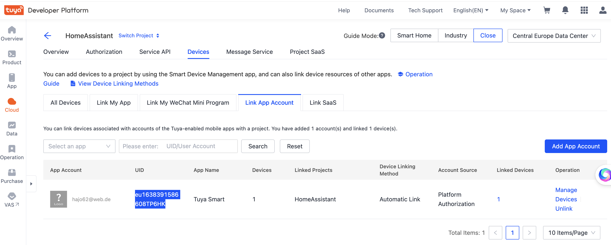

# Hama Außensteckdose Wlan
## Setup
Diese [Steckdose](https://de.hama.com/00176570/hama-wlan-steckdose-outdoor-ohne-hub-f-sprach-u-app-steuerung-2300w-10a=) von Hama kann über eine App von [Hama](http://itunes.apple.com/de/app/hama-smart-solution/id1415667604?mt=8) bzw. von [Tuya](https://apps.apple.com/de/app/tuya-smart/id1034649547) gesteuert werden. Um die Steckdose _lokal_, also ohne Cloud-Zugriff steuern zu können, gibt es die [lokal Tuya-Integration](https://github.com/rospogrigio/localtuya/).

Um die Steckdose _lokal_ betreiben zu können, muss man deren `id` und `key` auslesen. Wie das geht, steht [hier](https://github.com/codetheweb/tuyapi/blob/master/docs/SETUP.md) beschrieben. Dazu muss man sich bei [iot.tuya.com](iot.tuya.com) registrieren, die Tuya Smart-App installieren und dort die Steckdose verbinden.

Werte aus der Registrierung:  
https://iot.tuya.com/cloud/basic?id=p1638388259718rymhvt&toptab=project
* Access ID/Client ID: ed7gyttgb504ojki85ko
* Access Secret/Client Secret: abc4a6e5c7564e67bd0d6a0ae302d4d3
```
[ { name: '00176570',
    id: '4736523170039f4d68db',
    key: '5c025e353a276257' } ]
```

## Erneutes Einbinden
Nach Problemen mit dem 2,4 GHz-WLAN war die Verbindung zum HA nicht mehr vorhanden. Widereinbinden hat nicht funktioniert, da mir die UID fehlte.
```
UID: eu1638391586608TP6HK
```
[Hier](https://github.com/rospogrigio/localtuya/issues/858#issuecomment-1155201879) habe ich den entscheidenden Tipp gefunden.  
Die findet man [hier](https://eu.platform.tuya.com/cloud/basic?id=p1638388259718rymhvt&toptab=related&region=EU&deviceTab=4) unter `Cloud / Devices`:

## Automatisierung
Ich möchte mit der Steckdose die Außenbeleuchtung nach Sonnenuntergang (mögl. nur, wenn ich zu Hause bin) einschalten. Wenn ich nach Sonnenuntergang heimkomme, soll die Beleuchtung eingeschaltet werden. Um 23:50 Uhr soll diese wieder ausgeschaltet werden. Dazu gab es einen [Lösungsvorschlag](https://community.home-assistant.io/t/switch-on-the-light-when-sun-goes-down-but/362502/3) im Forum.
```
alias: Außenlicht bei Sonnenuntergang
description: ''
trigger:
  - platform: sun
    event: sunset
    offset: '00:30:00'
    id: sun
  - platform: time
    at: '23:30'
    id: time
  - platform: state
    entity_id: device_tracker.iphone_8_hans_joachim
    from: not_home
    to: home
    id: home
condition: []
action:
  - choose:
      - conditions:
          - condition: trigger
            id: sun
        sequence:
          - condition: state
            entity_id: device_tracker.iphone_8_hans_joachim
            state: home
          - service: switch.turn_on
            target:
              device_id: fbece82113e679c6a933b4d4d655e502
      - conditions:
          - condition: trigger
            id: time
        sequence:
          - service: switch.turn_off
            target:
              device_id: fbece82113e679c6a933b4d4d655e502
      - conditions:
          - condition: trigger
            id: home
        sequence:
          - condition: sun
            after: sunset
          - condition: time
            before: '23:30'
          - service: switch.turn_on
            target:
              device_id: fbece82113e679c6a933b4d4d655e502
    default: []
mode: single
```