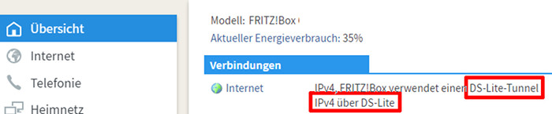

# Internetzugriff auf das Heimnetz
## DS-Lite-Tunnel
Mein Internet-Provider [1&amp;1](http://www.1und1.de/) hatte meinen DSL-Anschluss vor einiger Zeit auf einen  [DS-Lite-Tunnel](https://de.wikipedia.org/wiki/IPv6#Dual-Stack_Lite_(DS-Lite)) umgestellt.  

Dadurch wurde meinem Anschluss keine IPv4-Adresse mehr zugeteilt und ein im Heimnetz betriebener Rechner ist von außen nicht über das **IPv4-Netz** erreichbar. (Siehe dazu z.B. [hier](https://avm.de/service/fritzbox/fritzbox-7490/wissensdatenbank/publication/show/1611_Was-ist-DS-Lite-und-wie-funktioniert-es/)). Abhilfe würde hier ein [4in6-Tunnel](https://de.wikipedia.org/wiki/4in6) schaffen. Da die 4in6-Tunnel-Anbieter **sixXS** oder **gogo6** ihre Dienste eingestellt haben, scheinen solche Tunnel nicht mehr verfügbar zu sein.  

Erstaunlicherweise genügte aber ein Anruf bei der 1&1-Hotline (+49 721 9600) und mein Anschluss wurde nach wenigen Minuten auf einen *vollen* DSL-Anschluss mit dynamischer IPv4-Adresse umgestellt.  

## Internetzugriff auf der Fritzbox aktivieren
Unter `Internet / My!FRITZ-Konto` muss ein **MyFRITZ!-Konto** eingerichtet und anschließend die Option **MyFRITZ!-Internetzugriff** aktiviert werden.

Nun ist die Fritzbox von außen erreichbar.

###	Zertifikate
Die Browser-Verbindung auf die Fritzbox ist über ein **Self-Signed-Certificate** gesichert; bei jedem ersten Browser-Zugriff gibt es eine Sicherheits-Warnung. Um die Warnung zu Umgehen bietet die Fritzbox die Möglichkeit, ein _ordentliches_ Zertfikat von [letsencrypt.org](https://letsencrypt.org) zu holen und automatisch alle 60 Tage erneuern zu lassen.  

Dazu unter `Internet/MyFRITZ-Konto` die Option `Zertifikat von letsencrypt.org verwenden` aktivieren.  

## DynDNS
Da einem privaten DSL-Anschluss meist keine **feste** IP-Adresse zugeordnet ist und diese sich bei jedem Verbindungsneuaufbau ändern kann, ist es hilfreich, dem Netz über [**dynDNS**](https://de.wikipedia.org/wiki/Dynamisches_DNS) einen festen Domain-Namen zuzuweisen (&quot;Dynamic Updates in the Domain Name System (DNS UPDATE)&quot;).  

Die einfachste Möglichkeit bietet hier gleich die Fritzbox selbst; im Feld `Ihre MyFRITZ!-Adresse` wird der generierte Name angezeigt.  

Sollte einem die kryptische Domain nicht zusagen, kann man über einen dynDNS-ANbieter eine sprechendere Domain erstellen. (Weitere Unterschiede bzw. Vor- oder Nachteile sind mir nicht bekannt).  

### dynDNS von Internetanbietern
Der Anbieter [DuckDNS](http://duckdns.org) ist kostenlos und man sich ohne einen weiteren Account anlegen und sich merken zu müssen, einfach z.B. mit seiner googlemail-Adresse anmelden.  

Nun einfach eine Domain (z.B. [https://myDNS.duckdns.org](https://myDNS.duckdns.org)) erzeugen und die IPv4-Adresse eintragen. Anschließend kann man die Verbindung mit `ping <myDNS>.duckdns.org` prüfen.  

Damit die geänderten IP-Adressen dem dynDNS-Dienst bekannt gegeben werden, muss in der Fritzbox unter `Internet / Freigaben / DynDNS` noch die Update-Url (z.B. https://www.duckdns.org/update?domains=mydmyDNSomain.duckdns.org&<token=token-von-dyndns>&ip=<ipaddr>&.ipv6=<ip6addr>) hinterlegt werden.
[Hier](https://8300111.de/fritzbox-mit-os-6-60-dynamic-dns-mit-duck-dns-einrichten-schnell-und-kostenlos) findet sich dazu eine kurze Beschreibung.  

## Portfreigabe(n) in der FRITZ!Box einrichten
Damit der Raspberry Pi von außen erreichbar wird, müssen die gewünschten Ports auf der Fritzbox freigegeben und ggf. auf andere Ports weitergeleitet werden. Die wichtigsten Ports sind:  

| Protokoll     | Port (intern) | Port (extern) |
| ------------- | ------------- | ------------- |
| http          | 80            | 80 - Nur kurz für letsencrypt freigeben
| https         | 443           | 443
| ssh           | 22            | ändern z.B. 53022
| vnc           | 5900          | ändern z.B. 53023

Eine genaue Beschreibung zur Portfreigabe von **avm** findet sich [hier](https://avm.de/service/fritzbox/fritzbox-7390/wissensdatenbank/publication/show/893_Statische-Portfreigaben-einrichten/):  

Nachdem die Freigabe z.B. für Port 22 aktiviert wurde, ist der Raspberry Pi nun per SSH auch von außen über den dynDNS-Name erreichbar:  
`ssh -p 53022 pi@xxxxx.myfritz.net`

---

Spätestens jetzt sollte man sich ein wenig um die [Sicherheit](security.md) kümmern.  

